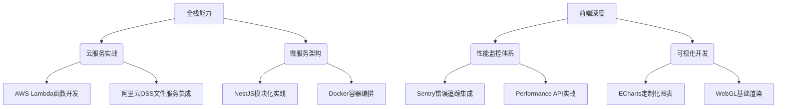
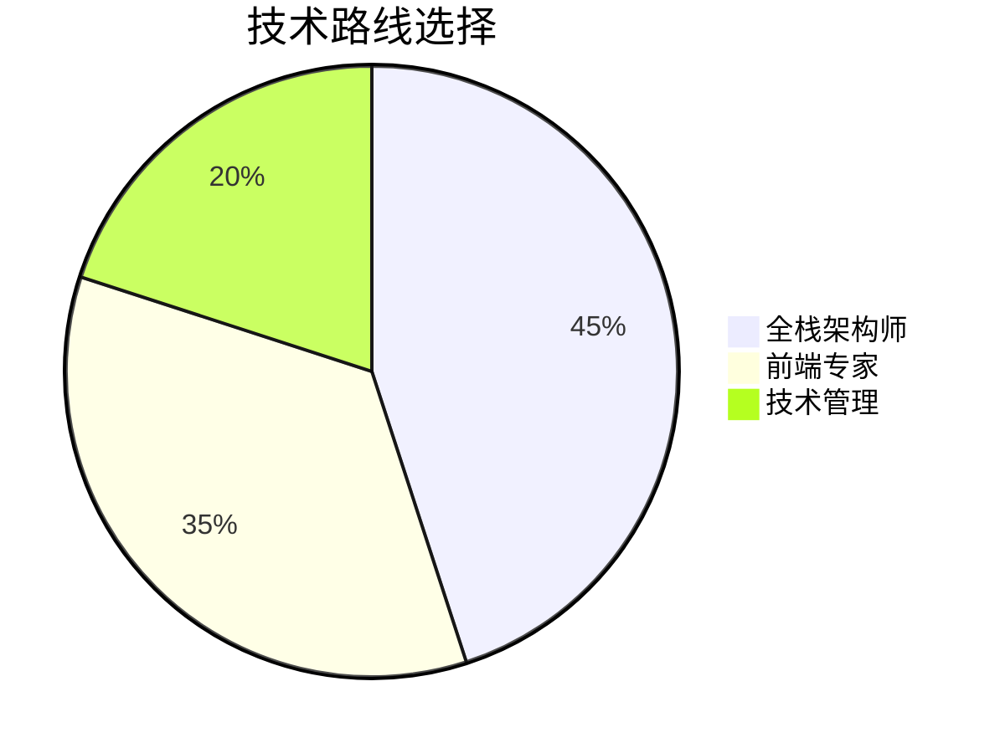

### 思考
好的，用户现在是一名刚毕业半年的前端开发，不想考公务员，想要转全栈或者成为资深前端开发，寻求更详细的规划。之前我已经给出了一个分阶段的策略，但用户希望更详细更好的规划。我需要进一步细化每个阶段的具体行动，可能包括技术学习、项目实践、资源推荐、时间管理等方面。

首先，用户需要明确是选择全栈还是资深前端，但可能两者有交叉，可以兼顾。需要考虑到技术栈的深度和广度，以及市场需求。用户可能处于初级阶段，需要夯实基础，同时积累项目经验。

接下来，我需要将之前的三个阶段（夯实基础、项目实战、专业深耕）进一步细化，可能拆分为更小的时间段，比如每月或每季度的目标。例如，在夯实基础阶段，可以具体到每周学习哪些知识点，完成哪些小项目。

还要考虑用户的实际工作情况，如何平衡工作和学习。可能需要建议时间管理方法，比如每天安排固定时间学习，利用周末进行项目实践。

资源方面，除了之前推荐的平台和文档，可能需要更具体的课程、书籍推荐，以及如何有效利用这些资源。例如，推荐一些实战课程或者开源项目，让用户能够边学边做。

职业发展策略部分，可能需要更详细的步骤，比如如何准备面试，如何展示自己的项目，如何积累技术影响力。同时，要考虑用户可能的瓶颈，比如如何突破中级到高级的阶段，需要哪些软技能的提升。

风险控制方面，用户可能会遇到技术疲劳、方向迷茫等问题，需要给出应对策略，比如定期复盘、加入学习小组、寻找mentor等。

最后，要确保整个规划具有可操作性和可调整性，用户可以根据自身情况灵活调整。同时，保持积极的心态和持续的学习动力是关键，可以建议用户设定短期目标，逐步实现，增强成就感。

### 超详细全栈/资深前端进阶规划（分季度执行版）

---

#### **第0阶段：自我定位与基建准备（1-2周）**
**目标**：建立可量化的成长坐标系
- **技术审计**：用[前端技能矩阵表](https://frontendchecklist.io/)自评当前水平（如JS基础7/10，React原理5/10）
- **硬件升级**：
  - 配置开发环境（Node.js LTS版 + VS Code插件：Prettier/ESLint/GitLens）
  - 购买云服务器（阿里云/腾讯云新人版，年费约100元）
- **知识管理**：
  - 创建Notion知识库（模板：[Developer Portfolio](https://www.notion.so/templates/developer-portfolio)）
  - 配置RSS订阅（阮一峰周刊、JavaScript Weekly）

---

### **第一年：筑基突围**

#### **Q1-Q2（1-6个月）：核心能力锻造**
**每日节奏**（工作日3小时+周末8小时）：
- **晨间30min**：LeetCode/CodeWar算法训练（从Easy逐步到Medium）
- **晚间2h**：系统化学习（按模块拆解）
- **周末实战**：完整项目开发+技术博客输出

**技术攻坚表**：
| 模块          | 关键内容                                                                 | 验证方式                     |
|---------------|--------------------------------------------------------------------------|------------------------------|
| **JavaScript**| 闭包/原型链/EventLoop实战（参考《You Don't Know JS》系列）               | 手写Promise/Axios核心逻辑    |
| **React进阶** | Hooks源码解析（useState闭包陷阱）、性能优化（memo/useCallback最佳实践） | 实现虚拟滚动列表组件         |
| **工程化**    | Webpack拆包策略、TreeShaking原理、SSR方案对比                            | 优化项目构建速度至3s内       |
| **Node基础**  | Express中间件机制、JWT鉴权实现、PM2集群部署                             | 开发RESTful API支持CRUD操作  |

**项目里程碑**：
1. **个人技术博客**（React+Node.js+MySQL）：
   - 实现Markdown双链笔记功能（类似Obsidian）
   - 接入Github Actions自动部署
   - 优化首屏加载至Lighthouse评分>90
2. **开源贡献**：
   - 修复Ant Design组件库的Good First Issue
   - 开发VSCode插件（如代码片段生成器）

---

#### **Q3-Q4（7-12个月）：多维能力拓展**
**技术拓展地图**：

**复合型项目**：
- **电商中台系统**：
  - 前端：微前端架构（qiankun）+ 低代码表单生成器
  - 后端：NestJS + Redis缓存 + ElasticSearch商品检索
  - 部署：Docker Compose + Nginx负载均衡
- **数据可视化平台**：
  - 核心技术：D3.js动态图表 + WebSocket实时更新
  - 扩展能力：大数据量优化（Web Worker计算）

**影响力建设**：
- 在掘金发布3篇深度系列文章（如《从零实现React调度器》）
- 在Github创建500+Star项目（领域聚焦如低代码方向）
- 参与技术大会闪电演讲（如JSConf China新秀场）

---

### **第二年：领域深耕**

#### **专项突破方向选择**

**全栈架构师路径**：
1. 掌握DDD领域驱动设计
2. 实践CQRS模式（如NestJS+Axoniq框架）
3. 构建百万级并发系统（压力测试工具：JMeter）

**前端专家路径**：
1. 研究Chromium渲染引擎原理
2. 开发Babel插件实现语法糖
3. 深入WebAssembly性能优化

**技术管理预备**：
- 学习《技术领导力》核心模型
- 在团队内推动Code Review机制
- 设计前端监控告警体系（Prometheus+Grafana）

---

### **第三年：价值跃迁**

#### **职业突破策略**
1. **大厂晋升通道**：
   - 准备P7级晋升材料（重点突出架构设计能力）
   - 主导跨团队基建项目（如搭建私有NPM仓库）
2. **技术创业准备**：
   - 开发垂直领域SaaS工具（如低代码问卷系统）
   - 构建开发者工具链（如CLI脚手架工具）
3. **行业影响力变现**：
   - 开发付费技术课程（平台：极客时间/慕课网）
   - 提供架构咨询（服务中小型技术团队）

---

### **执行保障系统**

#### **学习效能工具包**
| 类型         | 工具推荐                                                                 |
|--------------|--------------------------------------------------------------------------|
| 知识管理     | Obsidian（双链笔记）+ Readwise（碎片信息聚合）                          |
| 效率提升     | Cold Turkey（屏蔽干扰）/ WakaTime（编码时间分析）                       |
| 代码质量     | SonarQube（代码异味检测）/ Husky（Git Hook管理）                        |

#### **防脱轨机制**
- 每月技术复盘会（使用OKR模板跟踪进度）
- 加入 accountability group（3人互助监督小组）
- 设置弹性调整期（每季度可修订10%计划内容）

---

### **关键转折点预警**
1. **12个月节点**：若未完成2个完整项目，立即启动「100小时冲刺计划」
2. **18个月节点**：若未进入目标公司，启动「模拟面试周」（每天3场技术面）
3. **24个月节点**：若未达成专家级能力，考虑专项特训营（如ByteDance Web Infra组开源项目）

---

### **资源配置表**
**付费资源优选**：
- 极客时间《前端进阶训练营》（体系化知识）
- Udemy《Microservices with Node JS and React》（实战案例）
- Frontend Masters《Advanced CSS》（可视化专家课程）

**免费资源精选**：
- [Google Web Fundamentals](https://web.dev/)（最新规范解读）
- [Node.js Best Practices](https://github.com/goldbergyoni/nodebestpractices)（工程化宝典）
- [React RFC仓库](https://github.com/reactjs/rfcs)（掌握框架演进方向）

---

### **终极检验标准**
- **技术层面**：能独立设计并落地支撑千人使用的B端系统
- **市场价值**：年薪达到所在城市技术岗位前10%水平
- **行业影响**：至少有1个技术方案被社区广泛引用

通过这套精确到季度的作战地图，配合每日3小时的深度学习投入，你将在36个月内完成从初级到专家的蜕变。记住：在代码的世界里，时间复杂度的优化永无止境，但正确的算法选择能让成长速度提升一个数量级。