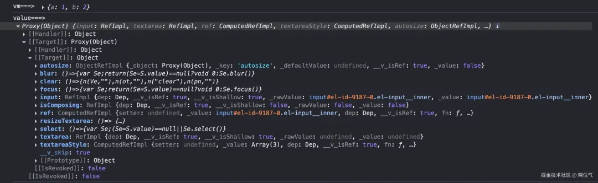

## Vue3 中二次封装组件
> 从二次封装 el-input 开始 🧀

### 要解决的问题
1. props 如何透传出去？
2. slots 如何透传出去？
3. 组件的方法如何暴露出去 ？
4. 如何让 ts 类型完备 ？

## 处理 props
### 传递 $attrs
为了保证组件原有「属性」和事件能被正常传递，我们可以使用 `mergeProps` 合并 `$attrs` 和重写默认属性或新增 `props` 对象，绑定到原有组件:

`mergeProps()`: 合并多个 `props` 对象，用于处理含有特定的 `props` 参数的情况。
`mergeProps()` 支持以下特定 `props` 参数的处理，将它们合并成一个对象。
- `class`
- `style`
- `onXxx` 事件监听器——多个同名的事件监听器将被合并到一个数组。
如果你不需要合并行为而是简单覆盖，可以使用原生 `object spread` 语法来代替。
```typescript
import { mergeProps } from 'vue'

const one = {
  class: 'foo',
  onClick: handlerA
}

const two = {
  class: { bar: true },
  onClick: handlerB
}

const merged = mergeProps(one, two)
/**
 {
   class: 'foo bar',
   onClick: [handlerA, handlerB]
 }
 */
```

1. `$attrs` 包含所有传入的 `props` 和 `emit` 事件；
2. 直接使用 `$attrs` 是没有 `TS` 类型提示的，所以我们要声明一个 `props`，至于 `props` 类型一般组件库都会导出。
```vue
<script setup lang="ts">
import { mergeProps } from 'vue'
import type { ExtractPublicPropTypes } from "vue"
import type { InputProps } from 'element-plus'
const props = defineProps<ExtractPublicPropTypes<InputProps>>()
</script>

<template>
  <!-- <el-input v-bind="{...$attrs, ...props}"></el-input> -->
  <el-input v-bind="mergeProps($attrs, props)"></el-input>
</template>
```
「▶️ `ExtractPublicPropTypes` 类型是什么作用 ？」
其实，在上面的代码中，对于 props 的 TS 类型定义，一开始其实我使用的是 `Partial<InputProps>` ，把所有属性都变成可选，这样父组件使用时类型提示才不会报错，但是这样并不严谨，如果组件里有 props 属性是必填的，那可能不会有完备的类型提示。

对于 TypeScript 如果需要获取 Props 的类型，那就需要用到 Vue 的一个辅助类型`ExtractPropTypes`，而在 element-plus 源码中， 大部分组件的 props 是用 `ExtractPropTypes<typeof inputProps>` 抽离的。

这里是我们属于二次封装组件，所以我们是外部引用 （父组件），对于外部引用，我们就使用 `ExtractPublicPropTypes`。

### 覆盖默认值
我们可以使用 `withDefaults` 给 props 设置默认值，从而达到覆盖原组件默认值的效果
```vue
<script setup lang="ts">
import { mergeProps } from 'vue'
import type { ExtractPublicPropTypes } from "vue"
import type { InputProps as ElInputProps } from 'element-plus'

type InputProps = ExtractPublicPropTypes<ElInputProps> & {
  /* 可以在此处添加新属性 */
}

const props = withDefaults(defineProps<InputProps>(), {
  clearable: true, // 改变el-input clearable 默认值
	 /* 可以在此处为新属性添加默认值 */
})
</script>

<template>
  <el-input v-bind="mergeProps($attrs, props)"></el-input>
</template>
```

## 处理 slots
### 常规版本
我们以 `element-plus Input` 输入框组件为例，为了向子组件传递插槽，常规的做法 , 遍历 `$slots`来实现，不论是封装什么组件都可以无脑使用 `v-for v-for="(_, name) in $slots"`，即使组件插槽相互有逻辑也不会被影响。
```vue
<script setup lang="ts">
import { mergeProps } from 'vue'
import type { ExtractPublicPropTypes } from "vue"
import type { InputProps as ElInputProps } from 'element-plus'

type InputProps = ExtractPublicPropTypes<ElInputProps> & {}
const props = withDefaults(defineProps<InputProps>(),{})

</script>

<template>
  <el-input v-bind="mergeProps($attrs, props)">
      <template v-for="(_, name) in $slots" :key="name" #[name]="slotProps">
        <slot :name="name" v-bind="slotProps"></slot>
      </template>
  </el-input>
</template>
```
`#[name]="slotProps"` 等同于 `v-slot:[name]="slotProps"`。

「关于遍历 $slot 写法问题」
$slots 是个 Proxy 对象，下面的写法均可:
```typescript
$slots = {
  append: () => [...],
  suffix: () => [...],
  // 可能还有其他具名插槽
}
v-for="(_, name) in $slots"
v-for="(_, name) of $slots"
v-for="(_, name) Object.keys($slots)"
```
示例：在父组件使用， 并传递 `append`、`suffix` 插槽：
```vue
<template>
    <div>
       <h3>👨 父组件</h3>
       <YiInput ref="inputRef" v-model="msg" placeholder="请输入内容">
            <template #append>
               <el-icon><Search /></el-icon>
            </template>
            <template #suffix>
               <el-icon><User /></el-icon>
            </template>
        </YiInput>
    </div>
</template>

<script lang="ts" setup>
import { Search, User } from '@element-plus/icons-vue'
import type { InputInstance } from 'element-plus'

const inputRef = ref<InputInstance>()
const msg = ref('Hello world')

setTimeout(() => {
  inputRef.value?.focus() // 自动聚焦
}, 3000)
</script>
```

### 使用 h 函数 （花活版🌸）
```vue
<script setup lang="ts">
import { ElInput } from "element-plus"
import type { ExtractPublicPropTypes } from "vue"
import type { InputProps as ElInputProps } from 'element-plus'

type InputProps = ExtractPublicPropTypes<ElInputProps> & {}
const props = withDefaults(defineProps<InputProps>(),{})
</script>

<template>
  <component :is="h(ElInput, { ...$attrs, ...props }, $slots)" />
</template>
```

### 使用 Vue 3.3+ 新增加辅助函数 （ 花活版 🌸 ）
在 Vue 中，我们可以在模板中直接通过 `$slots` 和 `$attrs` 来访问它们、 在 Vue 3.4 版本之后，可以分别用 `useSlots` 和 `useAttrs` 两个辅助函数：

```vue
<script setup lang="ts">
import { h, mergeProps, useAttrs, useSlots } from 'vue'
import { ElInput } from "element-plus"
import type { ExtractPublicPropTypes } from "vue"
import type { InputProps as ElInputProps } from 'element-plus'

type InputProps = ExtractPublicPropTypes<ElInputProps> & {}

const props = withDefaults(defineProps<InputProps>(),{})
const attrs = useAttrs()
const slots = useSlots()
const $props = mergeProps(attrs, props)

</script>

<template>
   <component :is="h(ElInput, $props, slots)" />
</template>
```

「▶️ component 组件为什么可以传入 h 函数 ？」
h函数用于创建虚拟 DOM 节点（`vnode`），is 属性接收到一个函数时，
也就是`h(ElInput, $attrs, $slots)` ，会立即执行并返回一个 VNode，
这个 VNode 描述了如何渲染 ElInput 组件。

### 处理 ref
「问题： 封装时如何导出原组件实例方法？」

在二次封装子组件时，为了让父组件能够获取子组件的 ref， 并能够调用一些原有的方法，我们还需要将子组件的方法暴露出去。

对于这个需求，网上方法五花八门，但是在 Vue3 的 setup 模板中，我个人认为，「其实并没有特别优雅的方式」。
1. 向父组件暴露 `ref` 函数
   思路：创建一个 `getRef` 的函数，把 `ref` 暴露出去, 父组件调用 `getRef` 方法后在执行子组件方法的调用：
```vue
<script setup lang="ts">
import { ref } from 'vue'

const rawRef = ref()
const getRef = () => inputRef.value

defineExpose({ getRef })
</script>

<template>
   <el-input ref="rawRef" v-bind="{...$attrs, ...props}" />
</template>
```
2. 使用 `Proxy` 代理
   另一个思路，我们可以使用 `Proxy` 代理暴露出去的方法：
```vue
<script setup lang="ts">
import { ref } from 'vue'
const rawRef = ref()

defineExpose(
  new Proxy({},
    {
      get: (_target, key) => rawRef.value?.[key],
      // 因为代理的是一个空对象，用 has 判断一下，访问的属性是否存在
      has: (_target, key) => key in (rawRef.value || {})
    }
  )
)
// 通过 get，你把所有属性/方法的访问都代理到了 rawRef.value（即 el-input 实例）上。
// 这样，在父组件中 inputRef.value 实际上就像是直接访问 <el-input> 一样了。
</script>

<template>
  <el-input ref="rawRef" v-bind="{...$attrs, ...props}" />
</template>
```

3. 使用 `vm.exposed`
```vue
<script setup lang="ts">
const props = defineProps()
const vm = getCurrentInstance()

const changeRef = (inputInstance) => {
	vm!.exposed = inputInstance || {}
  // 其实父组件不是直接拿到这个 exposed 的，拿的是子组件的代理对象,
  // 不能只改变 exposed 的值，还要改变 exposeProxy 的值
	vm!.exposeProxy = inputInstance || {}
  // 上面代码也可以直接写成: vm!.exposeProxy = vm!.exposed = inputInstance || {}
}
</script>

<template>
   <el-input ref="changeRef" v-bind="{...$attrs, ...props}" />
</template>
```

「Why ？」
我们添加一个 `defineExpose` 导出 `{ a: 1, b: 2 }`，然后打印 `vm.exposed` 和 `changeRef` 方法中返回的 `value` ：
```vue
<script setup lang="ts">
import { getCurrentInstance } from 'vue'

const vm = getCurrentInstance()
const props = defineProps()

console.log('vm===>',vm.exposed)

const changeRef = (inputInstance) => {
 console.log('value===>',inputInstance)
 vm.exposed = inputInstance ?? {}
}

defineExpose({a: 1, b: 2})
</script>

<template>
  <ElInput :ref="changeRef" v-bind="{...$attrs, ...props}" >
    <template v-for="(_, name) of $slots" #[name]="slotProps" :key="name">
        <slot :name="name" v-bind="slotProps"></slot>
    </template>
  </ElInput>
</template>
```


- 在子组件的 ref 传递一个函数 `changeRef` ，在这个函数中，可以拿到原先组件（el-input）的对外暴露的对象 (方法)；
- `getCurrentInstance` 获取的是当前组件的实例， `vm.exposed` 拿到的是 defineExpose 导出的 `{ a: 1, b: 2 }`

也就是说！`vm.exposed` 其实就是当前组件 `defineExpose({})` 对外抛出的对象，所以我们只要在 `changeRef` 函数中，
设置 `vm.exposed = inputInstance` ，就可以再次把 el-input 对外暴露的方法暴露给父组件。


## 处理 Typescript 类型
1. 完善 props 类型提示
```typescript
import type { InputProps as ElInputProps } from 'element-plus'
const props = withDefaults(defineProps<ElInputProps>(), {})
```
2. 完善 $slots 类型提示
```typescript
import { ElInput } from 'element-plus'
type InputSlots = InstanceType<typeof ElInput>['$slots']
defineSlots<InputSlots>()
```
3. 完善 $expose 类型提示
   这里的 `$expose` 指的是组件实例对外暴露的方法，如：Input 组件的 emit 事件（`@foucs、@blur`）等。
```typescript
import type { InputInstance as ElInputInstance } from 'element-plus'
defineExpose<ElInputInstance>()
```

## 终极版本 （TS 类型完备）
### 基础版
使用 `proxy` 暴露方法 :
```vue
<script setup lang="ts">
import type { InputInstance as ElInputInstance, InputProps as ElInputProps } from 'element-plus'
import { ElInput } from 'element-plus'
import { mergeProps } from 'vue'

type InputProps = ExtractPublicPropTypes<ElInputProps> & { /* 可以在此处添加新的 props */ }
type InputSlots = InstanceType<typeof ElInput>['$slots'] & {/* 可以在此处添加新的 slot */}
type InputInstance = ElInputInstance & {/* 可以在此处添加新的组件实例方法 */}

const props = withDefaults(defineProps<InputProps>(), {
  clearable: true, // 改变el-input clearable 默认值
  /* 可以在此处为新属性添加默认值 */
})

const rawRef = ref<InputInstance>()

defineSlots<InputSlots>()
defineExpose<InputInstance>(
  new Proxy(
    {},
    {
      get: (_target, key) => rawRef.value?.[key as keyof InputInstance],
      has: (_target, key) => key in (rawRef.value || {}),
    },
  ) as InputInstance,
)
</script>

<template>
  <ElInput v-bind="mergeProps($attrs, props)" ref="rawRef" class="e-input">
    <template v-for="(_, name) in $slots" #[name]="scope" :key="name">
      <slot :name="name" v-bind="scope" />
    </template>
  </ElInput>
</template>

<style lang="scss" scoped>
.e-input {
  min-width: 190px; // 添加新样式
  // :deep(xxx) {} 覆盖原有样式
}
</style>
```

### h 函数版
```vue
<script setup lang="ts">
import type { InputInstance as ElInputInstance, InputProps as ElInputProps } from 'element-plus'
import type { ExtractPublicPropTypes } from 'vue'
import { ElInput } from 'element-plus'
import { h } from 'vue'

type InputProps = ExtractPublicPropTypes<ElInputProps> & { }
type InputSlots = InstanceType<typeof ElInput>['$slots'] & {}
type InputInstance = ElInputInstance & {}

const props = withDefaults(defineProps<InputProps>(), {})

const vm = getCurrentInstance()
const changeRef = (inputInstance: InputInstance) => vm!.exposeProxy = vm!.exposed = inputInstance || {}

defineSlots<InputSlots>() // TS插槽类型提示
defineExpose<InputInstance>() //  实例类型提示（组件上的事件）
</script>

<template>
  <component :is="h(ElInput, { ...$attrs, ...props, ref: changeRef as any }, $slots)"/>
</template>
```

使用示例：
```vue
<template>
    <div>
    <h3>👨 父组件</h3>
    <YiInput ref="inputRef" v-model="msg" placeholder="请输入内容">
        <template #append>
            <el-icon><Search /></el-icon>
        </template>
        <template #suffix>
            <el-icon><User /></el-icon>
        </template>
    </YiInput>
    </div>
</template>

<script lang="ts" setup>
import { Search, User } from '@element-plus/icons-vue'
import type { InputInstance } from 'element-plus'
const inputRef = ref<InputInstance>()
const msg = ref('Hello world')

setTimeout(() => {
	inputRef.value?.focus() // 自动聚焦
	inputRef.value?.clear()
}, 3000)
</script>
```

