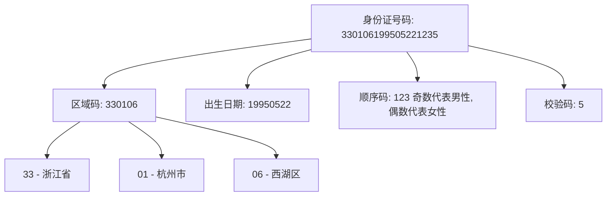

# 核心运行时 —— runtime-core
## 虚拟DOM如何创建？
使用 `h` 和 `createVNode` 这两个函数来创建虚拟节点，那么既然都是创建虚拟节点，为什么还需要两个函数呢？
实际上真正创建虚拟节点的是 `createVNode` 函数，而我们常用的 `h` 函数，只是对 `createVNode` 的参数进行了一个封装，更加方便我们的使用而已，
因为我们在使用 h 函数的时候，会存在多种场景，我根据使用习惯总结了以下几种比如：
1. `h('div', 'hello world')`第二个参数为 子节点
2. `h('div', [h('span', 'hello'), h('span', ' world')])` 第二个参数为 子节点
3. `h('div', h('span', 'hello'))` 第二个参数为 子节点
4. `h('div', { class: 'container' })` 第二个参数是 props
5. `h('div', { class: 'container' }, 'hello world')` 第二个是 props，第三个是子节点
6. `h('div', { class: 'container' }, h('span', 'hello world'))` 第二个是 props，第三个是子节点
7. `h('div', { class: 'container' }, h('span', 'hello'), h('span', 'world'))` 第二个是 props，后面所有的是子节点
8. `h('div', { class: 'container' },[h('span', 'hello'), h('span', 'world')])` 和 7 一个意思
可以看到，`h` 函数可以传递两个参数，也可以传递三个参数，第二个参数可以是子节点，也可以是 `props`，
`h` 函数，只是对 `createVNode` 的参数进行了一个标准化处理而已，
因为 `createVNode` 的第二个参数必须是 `props`，第三个参数必须是 `children`，没有例外，下面我们来看一下它们的实现方案：
```typescript
import { isArray, isObject } from '@vue/shared'

/**
 * h 函数的使用方法：
 * 1. h('div', 'hello world') 第二个参数为 子节点
 * 2. h('div', [h('span', 'hello'), h('span', ' world')]) 第二个参数为 子节点
 * 3. h('div', h('span', 'hello')) 第二个参数为 子节点
 * 4. h('div', { class: 'container' }) 第二个参数是 props
 * ------
 * 5. h('div', { class: 'container' }, 'hello world')
 * 6. h('div', { class: 'container' }, h('span', 'hello world'))
 * 7. h('div', { class: 'container' }, h('span', 'hello'), h('span', 'world'))
 * 8. h('div', { class: 'container' },[h('span', 'hello'), h('span', 'world')]) 和 7 一个意思
 */

export function h(type, propsOrChildren?, children?) {
  /**
   * h 函数，主要的作用是对 createVNode 做一个参数标准化（归一化）
   */

  let l = arguments.length

  if (l === 2) {
    // 两个参数的情况

    if (isArray(propsOrChildren)) {
      // h('div', [h('span', 'hello'), h('span', ' world')])
      return createVNode(type, null, propsOrChildren)
    }

    if (isObject(propsOrChildren)) {
      if (isVNode(propsOrChildren)) {
        // h('div', h('span', 'hello'))
        return createVNode(type, null, [propsOrChildren])
      }
      // h('div', { class: 'container' })
      return createVNode(type, propsOrChildren, children)
    }

    // h('div', 'hello world')
    return createVNode(type, null, propsOrChildren)
  } else {
    if (l > 3) {
      /**
       * h('div', { class: 'container' }, h('span', 'hello'), h('span', 'world'))
       * 转换成
       * h('div', { class: 'container' }, [h('span', 'hello'), h('span', 'world')])
       */
      children = [...arguments].slice(2)
    } else if (isVNode(children)) {
      // h('div', { class: 'container' }, h('span', 'hello world'))
      children = [children]
    }
    // 要是只传了 type
    return createVNode(type, propsOrChildren, children)
  }
}

/**
 * 判断是不是一个虚拟节点，根据 __v_isVNode 属性
 * @param value
 */
function isVNode(value) {
  return value?.__v_isVNode
}

/**
 * 创建虚拟节点的底层方法
 * @param type 节点类型
 * @param props 节点的属性
 * @param children 子节点
 */
function createVNode(type, props?, children?) {
  const vnode = {
    // 证明我是一个虚拟节点
    __v_isVNode: true,
    type,
    props,
    children,
    // 做 diff 用的
    key: props?.key,
    // 虚拟节点要挂载的元素
    el: null,
    shapeFlag: 9
  }

  return vnode
}
```
在虚拟节点(vnode)中有一个比较特殊的属性 shapeFlag，那么它的作用是什么呢？
打个比方就是有点类似于身份证号码，身份证号码的每一位，都代表不同的意思，我们来看一下下面的图：

在这张图中，有一个身份证号码 `330106199505221235`，我们身份证号码的每一位，都有它所表示的意义，
比如 33 开头，表示这个哥们一定是浙江省的，3301 表示这个哥们一定是浙江省杭州市的，那
既然这样，我们也可以假定，在 shapeFlag 中，如果某一位的值是 1，就表示它是一个 DOM，
或者某一位是 1，就表示它的子节点是一个文本，这样我们就可以在一个属性中通过这种组合的方式，表示更多的信息。
好，接下来我们先来看一下官方的 ShapeFlags：
```typescript
// packages/shared/src/shapeFlags.ts
export enum ShapeFlags {
  // 表示 DOM 元素
  ELEMENT = 1,
  // 表示函数组件
  FUNCTIONAL_COMPONENT = 1 << 1,
  // 表示有状态组件（带有状态、生命周期等）
  STATEFUL_COMPONENT = 1 << 2,
  // 表示该节点的子节点是纯文本
  TEXT_CHILDREN = 1 << 3,
  // 表示该节点的子节点是数组形式（多个子节点）
  ARRAY_CHILDREN = 1 << 4,
  // 表示该节点的子节点是通过插槽（slots）传入的
  SLOTS_CHILDREN = 1 << 5,
  // 表示 Teleport 组件，用于将子节点传送到其他位置
  TELEPORT = 1 << 6,
  // 表示 Suspense 组件，用于处理异步加载组件时显示备用内容
  SUSPENSE = 1 << 7,
  // 表示该组件应当被 keep-alive（缓存）
  COMPONENT_SHOULD_KEEP_ALIVE = 1 << 8,
  // 表示该组件已经被 keep-alive（已缓存）
  COMPONENT_KEPT_ALIVE = 1 << 9,
  // 表示组件类型，有状态组件与无状态函数组件的组合
  COMPONENT = ShapeFlags.STATEFUL_COMPONENT | ShapeFlags.FUNCTIONAL_COMPONENT
}
```
我们来看一下如何使用进行 ShapeFlag 进行判断某一个虚拟节点类型是什么，children 是什么：
```typescript
let shapeFlag = 0

const vnode = {
  __v_isVNode: true,
  type: 'div',
  children: 'hello world',
  shapeFlag
}

if (typeof vnode.type === 'string') {
  shapeFlag = ShapeFlags.ELEMENT // 1
}

if (typeof vnode.children === 'string') {
  /**
   * 或运算
   * 0001
   * 1000
   * 1001
   */
  shapeFlag = shapeFlag | ShapeFlags.TEXT_CHILDREN // 1001
}

vnode.shapeFlag = shapeFlag

if (vnode.shapeFlag & ShapeFlags.ELEMENT) {
  /**
   * 与运算
   * 1001
   * 0001
   * 0001
   */
  console.log('是一个 dom 元素')
}

if (vnode.shapeFlag & ShapeFlags.TEXT_CHILDREN) {
  /**
   * 与运算 两个相同的位置，都是1，就是1
   * 1001
   * 1000
   * 1000
   */
  console.log('子元素是一个纯文本节点')
}

if (vnode.shapeFlag & ShapeFlags.ARRAY_CHILDREN) {
  /**
   * 与运算
   * 01001
   * 10000
   * 00000
   */
  console.log('子元素是一个数组')
}
```
